#**1.Сетчатные структуры**#

Сетчатые структуры представляют с собой чередование монолитного материала с полостями. Подобные структуры очень распространены в природе, например, пчелиные соты (Рис.1.) или дерево.

| 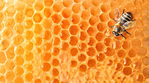 |
|------------------------------------------------------------|
| Рис.1. Соты – пример естественной сетчатой структуры       |

#**2.Применение сетчатых структур**#

В современном мире сетчатые структуры получают все более широкое применение. Их изготовление больше не ограничивается возможностями производсвта. Развитие технологий 3D печати и аддитивного производства позволяют изготавливать структуры со сложной георметрией, что еще вчера казалось невозможным.

##2.1. Машиностроение##

С инженерной точки зрения главным преимуществом использования сетчатых структур является повышение прочности конструкции в совокупности с относительно низкой массой. Кроме того, использование данных структур обеспечивает хорошую тепло и звукоизоляцию.

##2.2. Протезирование##

В последние годы развивается применение сетчатых структур в медицине. Изготавливаются протезы (Рис.2.) и импланты (Рис.3.) с применением таких технологий. Преимущества сетчатых имплантов в том, что ткани тела проростают внутрь импланта, таким образом заживление и приживание импланта происходит гораздо быстрее. Применение сетчатых структур при изготовлении протезов позволяет уменьшить напряжения на поверхности протеза и равномерно распределить их между костью и протезом, что позволяет минимизировать износ протеза. Еще один плюс – облегчение конструкции протеза.

| 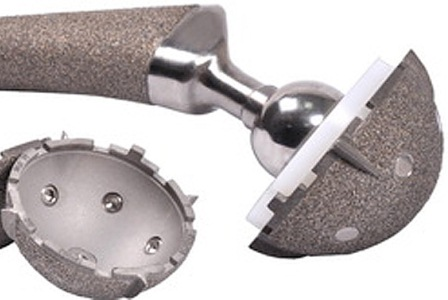                                   |
|------------------------------------------------------------|
| Рис.2. Протез сустава                                      |
| 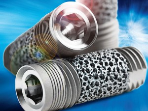 |
| Рис.3. Зубной имплант                                      |

##2.3. 3D печать##

Так же сетчатые структуры находят свое применение в 3D печати, при изготовлении сетчатых поддержек (Рис.4.) вместо сплошных (Рис.5.). Основной плюс применения данной технологии – экономия материалов и более простое удаление поддержек.

| 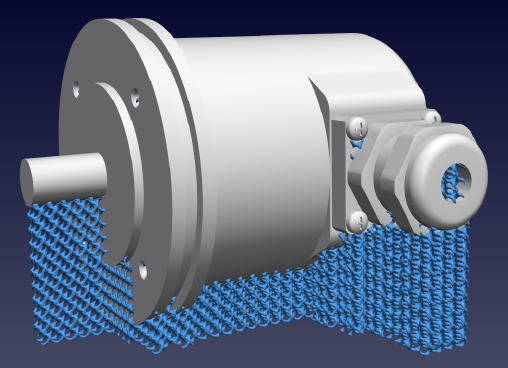                  |
|------------------------------------------|
| (Рис.4.) Модель с сетчатыми поддержками  |
| 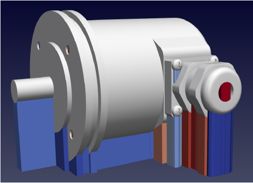                  |
| (Рис.5.) Модель со сплошными поддержками |

#**3.Типы сетчатых структур**#

##3.1. Сетчатые структуры различной плотности##

Наиболее распространенные сетчатые струкутры – структуры постоянной плотности (пример на Рис.6.)

| 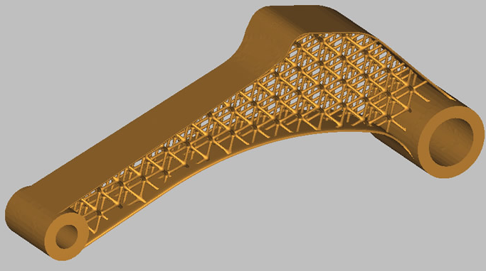                        |
|------------------------------------------------|
| Рис.6. Сетчатая структура постоянной плотности |

При необходимости можно использовать сетчатые структуры переменной плотности, например, чтобы усилить места с максимальными напряжениями. (Пример на Рис.7.)

| 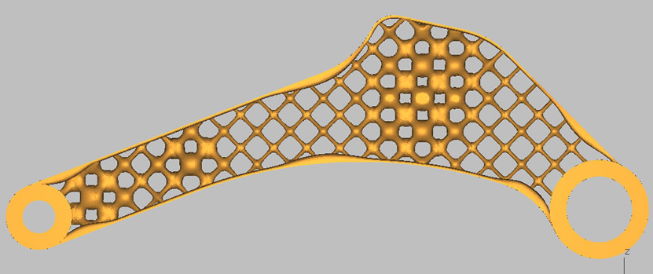 |
|-----------------------------------------------------------|
| Рис.7. Сетчатая структура переменной плотности            |

Еще один вид структур – переходные сетчатые структуры. Они использвуются, когда необходимо соединить 2 сетчатые структуры различной плотности, размера или типа ячеек. Пример таких структур на Рис.8. Эти структуры очень интересны, но практического применения они пока не нашли.

| 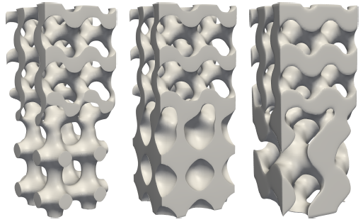 |
|-----------------------------------------------------------|
| Рис.8. Примеры переходных сетчатых структур               |

##3.2. Стохастические и упорядоченные сетчатые структуры##

Сетчатые структуры можно разделить на стохастические и упорядоченные. На Рис.9. и Рис.10. показаны различия между типами данных сетчатых структур.

| 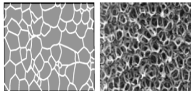                                    |
|------------------------------------------------------------|
| Рис.9. Примеры стохастических структур.                    |
| 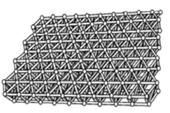 |
| Рис.10. Пример упорядоченной структуры.                    |

Упорядоченные структуры намного прочнее стохастических. Это связано с тем, что в процессе деформации стенки стохастических структур изгибаются, а упорядоченных – только сжимаются и растягиваются.

##3.3. Конформные и однородные сетчатые структуры##

Различие между конформными и однородными структурами представлено на Рис.11. и Рис.12. Однородные структуры заполняют объем вне зависимости от поверхности, его ограничивающей. Конформные же – повторяют форму ограничивающей поверхности.

| 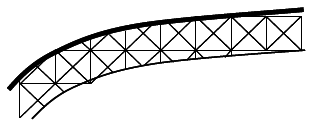               |
|----------------------------------------|
| Рис.11. Однородная сетчатая структура. |
| 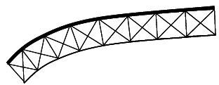               |
| Рис.12. Конформная сетчатая структура. |
|                                        |

Если сетчатая структуры внутренняя (ограничена твердой поверхностью), то различие между типами структур не принципиально, и можно использовать однородную сетчатую структуру (Рис.13.), иначе оправданно применение конформной структуры (Рис.14.).

| 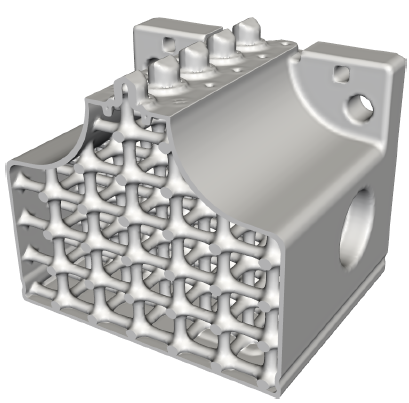                                                   |
|----------------------------------------------------------------------------|
| Рис.13. Внутренняя однородная сетчатая структура                           |
|                                                    |
| Рис.14.Конформная структура, не ограниченная снаружи твердой поверхностью. |

#**4. Параметры сетчатых структур**#

##4.1. Тип элементарной ячейки##

Сетчатая структура состоит из множества элементарных ячеек, которые расположены в определенных положениях и направлениях. Например, простейшая кубическая решетка состоит из элементарных кубов, имеющих общие ребра и вершины. (Рис.15. и Рис.16.)

| 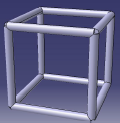 |
|------------------------------------------------------------|
| Рис.15. Элементарная кубическая ячейка                     |
| 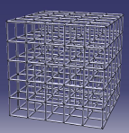 |
| Рис.16. Кубическая сетчатая структура                      |

Существует множество различных типов элементарных ячеек: от простых, как, например, расмотренная выше кубическая или октогональная ячейки, до более сложных, задаваемых неявными функциями.

- Октогональная ячейка (Рис.17.)

| 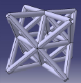 |
|------------------------------------------------------------|
| Рис.17. Элементарная октогональная ячейка                  |

- Примитив Шварца (Schwarz Primitive) (Рис.18.) задается функцией

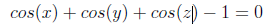

| 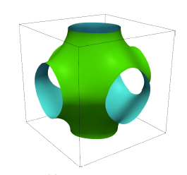                    |
|---------------------------------------------|
| Рис.18. Примитив Шварца (Schwarz Primitive) |

- Урезанный примитив Шварца (Schwarz Primitive pinched) (Рис.19.)

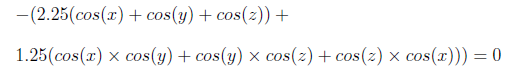

| 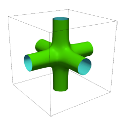                                      |
|---------------------------------------------------------------|
| Рис.19. Урезанный примитив Шварца (Schwarz Primitive pinched) |

- Гироид Шоэна (Schoen Gyroid) (Рис.20.)

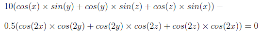

| 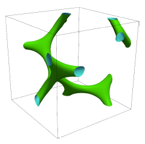             |
|--------------------------------------|
| Рис.20. Гироид Шоэна (Schoen Gyroid) |

- W-решетка Шварца (Schwarz W) (Рис.21.)

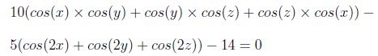

| 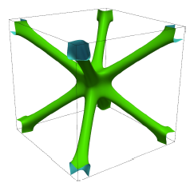             |
|--------------------------------------|
| Рис.21. W-решетка Шварца (Schwarz W) |

- Поверхность Неовиуса (Neovius' Surface) (Рис.22.)

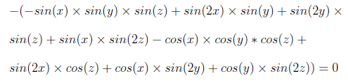

| 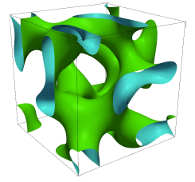 |
|------------------------------------------------------------|
| Рис.22. Поверхность Неовиуса (Neovius' Surface)            |

##4.2. Объемная доля##

Объемная доля – отношение материала стенок решетки ко всему объему решетки (Рис. 23). Объемная доля влияет на физические свойства решетки. Например, увеличение объемной доли ведет к увеличению модуля Юнга, но в то же время к уменьшению размеров ячеек и к уменьшению проницаемости структуры. От применения сеточной структуры зависит выбор объемной доли. Для структур, применяемых в медицине, она выбирается таким образом, чтобы свойства структуры совпадали с костью, которую она замещает. В ракето- и аэростроении объемная доля должна обеспечивать минимальный вес конструкции при максимальной жесткости.

Один из способов изменения объемной доли для элементарных ячеек, заданных неявной функцией, - изменение значений изоповерхности. Уменьшение или увеличение значения изоповерхности приводит к изменению объемной доли структуры. Но этот способ не позволяет точно контролировать объемную долю, для получения заданного значения объемной доли необходимо угадать правильное значение изоповерхности.

Значение изоповерхности задается формулой:f(p)=k, где k – значение изоповерхности, f(p) – неявная функция, задающая элементарную ячейку структуры.

Удобнее использовать значение изоповерхности равное 0, в таком случае вышеописанная формула примет вид: f'(p)=f(p)-k=0

Приближенное значение объемной доли может быть вычислено как отношение количества вокселей, попавший в объем, ограниченный изоповерхностью, к общему количеству вокселей в элементарной ячейке структуры.

| 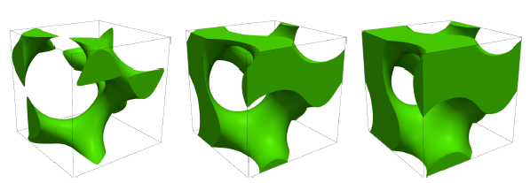 |
|------------------------------------------------------------|
| Рис. 23. Гироид Шоэна с объемной долей 15%, 33% и 50%.     |

##4.3. Размер элементарной ячейки##

Один из важных параметров при проектировании сетчатых структур – размер элементарной ячейки. При неизменной объемной доле количество элементарных ячеек в структуре увеличивается с уменьшением размера элементарной ячейки. (Рис.24.)

| 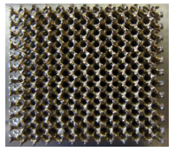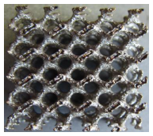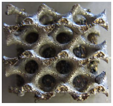 |
|------------------------------------------------------------------------------------------------------------|
| Рис.24. Гироид Шоэна с размерами ячейки 2мм, 5мм, 8мм.                                                     |

При слишком маленьком размере ячейки происходит утоньшение стенок и возможно их повреждение при изготовлении, потеря связи между соседними ячейками. Так же возможно возникновение сложностей с удалением материала поддежрки. Есть и ограничение на максимальный размер ячейки. При слишком длинных стенках возможно возникновение.

#**5.Обзор ПО для проектирования сетчатых структур**#

С распространением сетчатых структур в различных областях производства стало понятно, что традиционные программы автоматизированного проектирования плохо адаптированы для быстрого и легкого проектировани сетчатых структур. На сегодняшний день разрабатывается множество специализированных программ для проектирования различных сетчатых структур.

##5.1.Autodesk Within##

Используется для проектирования в медицинских целях (протезы, импланты) и в машиностроении (Рис.25). Предлагается библиотека элементарных ячеек, с возможностью оптимизации решетки в пределах определенного пространства (т.е. по предоставленным ограничениям и условиям нагрузки строится решетка переменного размера, 'оптимизированная' для заданных требований.)

| 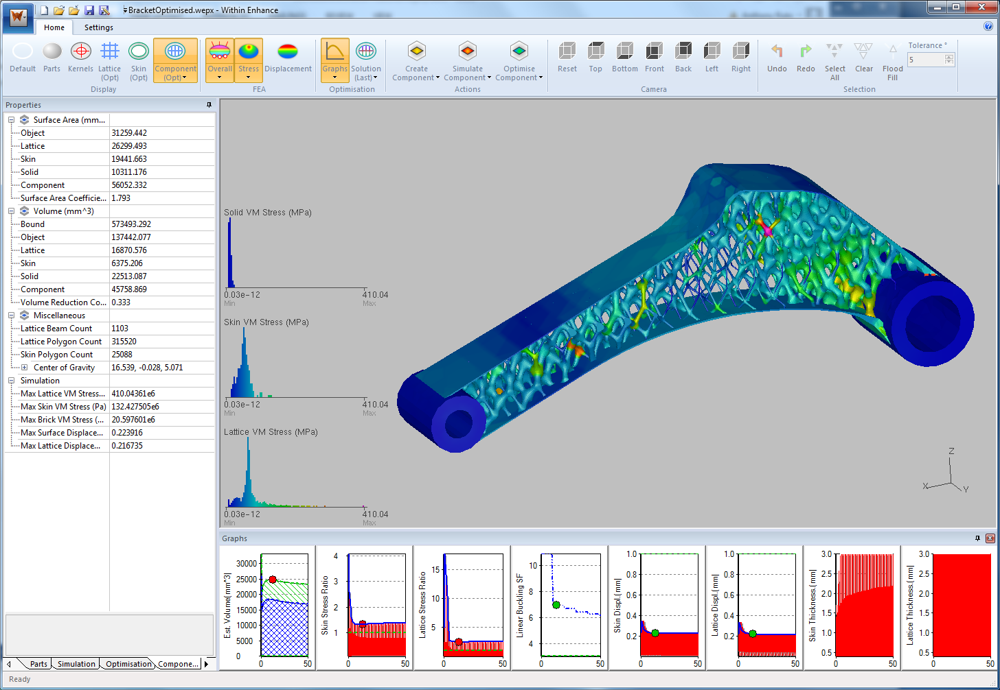                                                    |
|-----------------------------------------------------------------------------|
| Рис.25 Пример проектирования сетчатой структуры в программе Autodesk Within |

##5.2. Intralattice##

Создан в качестве платформы для исследований. Пользователю предоставляется свобода в создании собственной ячейки (есть также библиотека стандартных), есть возможность выбрать один из методов отображения решетки и установить толщину стенок ячеек. Можно заполнять различные по форме области (куб, цилиндр), создавать сетчатые структуры между двумя поверхностями, поверхностью и осью, посерхностью и точкой (Рис.26).

| 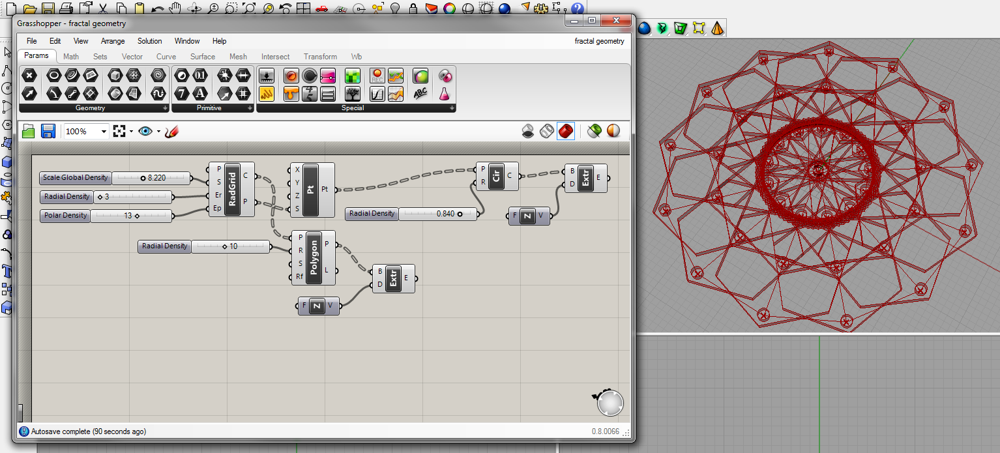                                                 |
|--------------------------------------------------------------------------|
| Рис.26 Пример проектирования сетчатой структуры в программе Intralattice |

##5.3. Netfabb##

ПО для подготовки моделей к 3D печати и аддитивному производству. Есть возможность создать свою ячейку или выбрать из библиотеки и заполнить область (Рис.27).

| 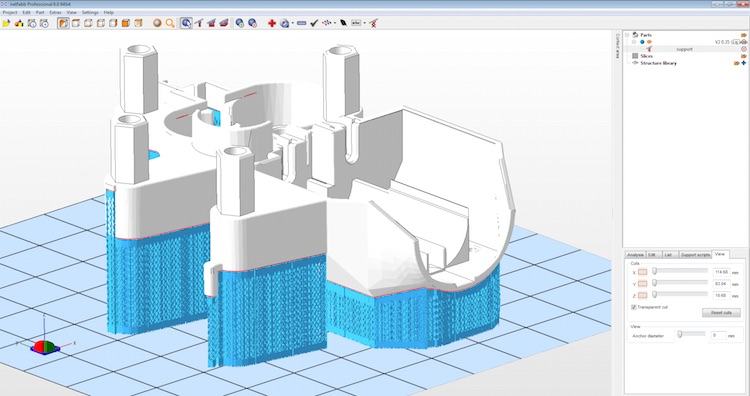         |
|---------------------------------------------------------------------|
| Рис.27 Пример проектирования сетчатой поддержки в программе Netfabb |

##5.4. Simpleware##

Simpleware – всемирноизвестная программная система обработки изображений для конвертирования изображений в полноценные 3D модели и последующего создания поверхностных и объемных конечно-элементных сеток, в том числе для структурного и гидродинамического анализа (Рис.28). Благодаря восстановлению данных, полученных при МРТ-сканировании, в трехмерный вид и возможности создания сеток, является помощником в медицине для быстрого создания имплантов, моделирования физиологических процессов и т.п. Также с Simpleware возможно изучение палеонтологии, современной флоры и фауны.

| 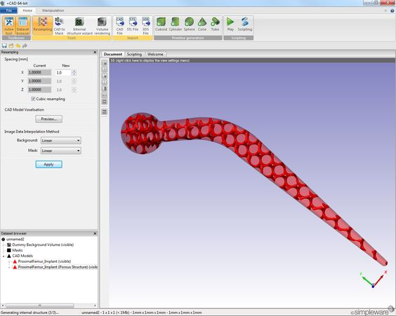            |
|------------------------------------------------------------------------|
| Рис.28 Пример проектирования сетчатой структуры в программе Simpleware |

##5.5. Materialise##

ПО для 3D печати. Применяется в инженерии и в медицине для прототипирования (Рис.29). Предлагается огромная библиотека единичных ячеек, которыми можно заполнить определенную область.

| 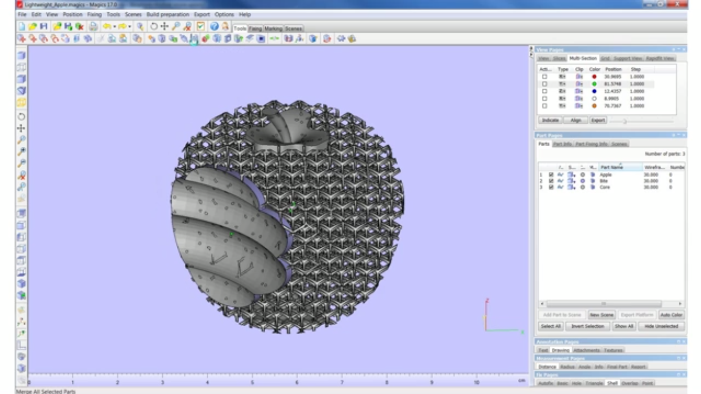                                                |
|-------------------------------------------------------------------------|
| Рис.29 Пример проектирования сетчатой структуры в программе Materialise ||

#**Список литературы:**#

1.  Raymont D.R. On the generation and characterisation of internal micro-architectures - 2011

2.  Yan C., Hussein A., Young, P. Design and additive manufacturing of cellular lattice structures - 2011

3.  Azman A.H., Vignat, F., Villene F. Design Configurations and Creation of Lattice Structures for Metallic Additive Manufacturing -2015

4.  Nguyen J., Park S., Rosen D.W., Folgar L., Williams J. Conformal Lattice Structure Design and Fabrication
