**Морфологические операции над изображениями. Фильтры и их назначение **

**ВВЕДЕНИЕ **

В данной статье речь пойдёт об операциях математической морфологии и матричных фильтрах обработки изображений, инструменты которых пригодятся для обработки томографических снимков.

Прежде чем приступить к рассмотрению морфологических операций и фильтров, вспомним о представлении графической информации на компьютере. Изображение состоит из точек, навзываемые пикселями. Каждый пиксель является носителем информации (см. Рисунок 1), которая представляется в виде одной из двух цифр: 0 (белый цвет) или 1 (черный цвет).

Рисунок 1

Математическая морфология используется для извлечения свойств изображения, полезных для его представления и описания. Входными данными для аппарата математической морфологии являются два изображения: обрабатываемое и специальное, зависящее от вида операции и решаемой задачи. Такое специальное изображения принято называть примитивом или структурным элементом. Структурный элемент представляет собой область в виде геометрической фигуры. Геометрия такой фигуры может быть любой, главное, чтобы её можно было представить в виде бинарного изображения заданного размера. Во многих пакетах обработки изображений наиболее распространенные структурные элементы имеют специальные названия: BOX\[H,W\] –прямоугольник заданного размера, DISK\[R\] — диск заданного размера, RING\[R\] – кольцо заданного размера (см. Рисунок 2).

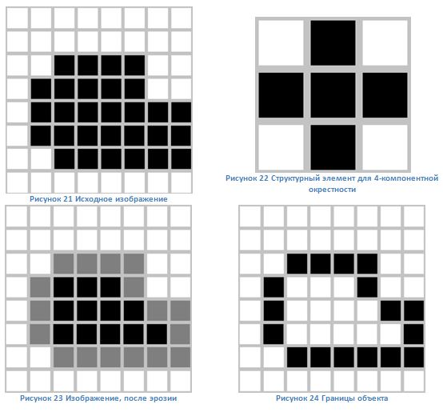

Рисунок 2

Одно из главных достоинств морфологической обработки - её простота: как на входе, так и на выходе мы получаем бинаризированное изображение.

Матричные фильтры обработки изображений позволяют получать на выходе изображение со свойствами, отличными от исходного. В основе работы каждого из фильтров лежит использование матрицы свертки, о которой пойдёт речь в соответствующем разделе. Далее разберёмся в принципе работы каждого из фильтров более подробно.

***1. Морфологические операции ***

Всего существует 4 основных морфологических операций: наращивание, эрозия, замыкание и размыкание. При детальном рассмотрении каждой из операций, мы будем использовать изображение и структурный элемент, показанные на рисунке 3.

Рисунок 3

Важно отметить, что начало координат выбранного структурного элемента находится в центре (см. рисунок 4).

Рисунок 4

*1.1. Перенос *

Операция переноса Xt множества пикселов X на вектор t задаётся в виде Xt={x+t|x∈X}. Следовательно, перенос множества единичных пикселов на бинарном изображении сдвигает все пикселы множества на заданное расстояние. Вектор переноса t может задаваться в виде упорядоченной пары (∆r,∆c), где ∆r – компонент вектора переноса в направлении строк, а ∆c — компонент вектора переноса в направлении столбцов изображения.

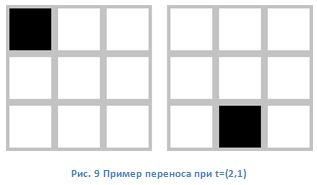

Рисунок 5

*1.2. Наращивание *

Обратимся к рисунку 3. Операция наращивания применяется к каждому пикселю. Происходит весь процесс следующим образом: начало координат структурного элемента (СЭ) совмещается с каждым пикселем исходного изображения. Если на пути начала координат СЭ встречается пиксель аналагичного цвета, то происходит операция объединения между СЭ и исходным изображением. Результаты логического сложения записываются в выходное бинарное изображение (см. рисунок 5).

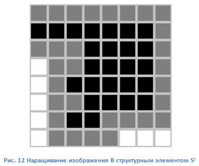

Рисунок 6

*
*

*1.3. Эрозия *

При выполнении операции эрозии структурный элемент тоже проходит по всем пикселам изображения. Если в некоторой позиции каждый единичный пиксел структурного элемента совпадет с единичным пикселом бинарного изображения, то выполняется логическое сложение центрального пиксела структурного элемента с соответствующим пикселом выходного изображения (см. рисунок 7).

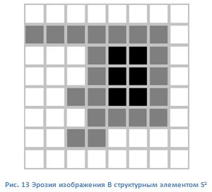

Рисунок 7

В результате применения операции эрозии все объекты, меньшие чем структурный элемент, стираются, размеры всех объектов уменьшаются.

*1.4. Размыкание *

Операция эрозии полезна для удаления малых объектов и различных шумов, но её недостаток – уменьшение всех оставшихся объектов в размере. Этого эффекта можно избежать, если после операции эрозии применить операцию наращивания с тем же структурным элементом.

Размыкание отсеивает все объекты, меньшие чем структурный элемент, но при этом помогает избежать сильного уменьшения размера объектов. Также размыкание идеально подходит для удаления линий, толщина которых меньше, чем диаметр структурного элемента. После выполнения этой операции контуры объектов становятся более гладкими.

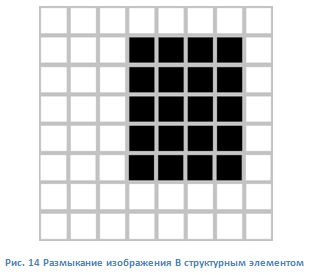

Рисунок 8

*1.5. Замыкание *

Операция замыкания практически идентична размыканию, за исключением того, что вначале выполняется операция наращивания, а потом эрозии. Замыкание позволяет избавиться от малых дыр и щелей при сохранении тех же размеров контуров объекта (см. рисунок 9).

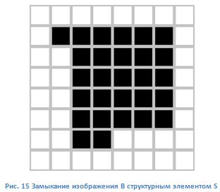

Рисунок 9

***2. Применение бинарной морфологии ***

Примером реального применения морфологических операций является выделение границ объекта. Эта операция является весьма важной, поскольку она позволяет весьма компактно и полно привести полное описание объекта.

Легко заметить, что граничные точки имеют как минимум один фоновый пиксел в своей окрестности. Таким образом, применив оператор эрозии с структурным элементом, содержащим все возможные соседние элементы, мы удалим все граничные точки… Тогда граница получится с помощью операции разности множеств между исходным изображением и изображением, полученным в результате эрозии (см. рисунок 10). Существуют фильтры, позволяющие выделять границы объектов, о которых мы поговорим в дальнейшем.

Рисунок 10

***3. Матричные фильтры обработки изображений ***

*3.1. Матрица свёртки *

Матрица свёртки – это матрица коэффициентов, которая «умножается» на значение пикселей изображения для получения требуемого результата. Алгоритм применения следующий. Начиная с верхнего левого пикселя, выделяем ядро размером матрицы свертки (см. рисунок 11).

Рисунок 11

Проводим перемножение между элементами матрицы свертки и выделенного ядра. Для примера, показанного на рисунке 11, результат будет следующим: 0⋅2+0⋅9+0⋅4+0⋅7+17⋅5+24⋅3+0⋅6+23⋅1+5⋅8=220. Далее вычисляем коэффициент нормирования, суммируя компоненты матрицы свёртки. Для нашего примера это значение будет равно 45. Результат перемножения матриц делим на коэффициент нормирования: 220:45=4.89. Полученное значение присваиваем центральному компоненту ядра. Весь цикл проделываем для каждого пикселя изображения.

*3.2. Фильтр размытия *

Наиболее часто используемым фильтром, основанным на матрице свёртки, является фильтр размытия. Фильтр меняет каждую точку выбранного ядра, делая её значение равным значению всех точек в определённом радиусе от рассматриваемой точки. Значение этого радиуса (размер матрицы) можно изменить.

Обычно матрица заполняется по нормальному (гауссовому закону). Ниже приведена матрица размытия 5x5 заполненная по закону Гауссовского распределения.

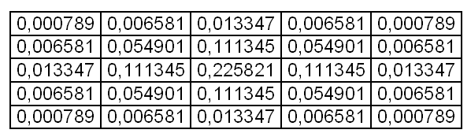

Важно отметить, что сумма элементов матрицы равна 1, поэтому и коэффициент нормирования так же равен 1. Сила размытия изображения зависит от размера матрицы свёртки (см. рисунок 12).

Рисунок 12

Данный фильтр предназначен для подавления шумов на изображении.

С ростом размера матрицы свертки подавляется и большее количество шумов на изображении. Однако стоит помнить, что при дальнейшем увеличении размера матрицы, картинка может получится более размытой и утратить чёткие очертания контуров объекта. Пример c матрицей свёртки 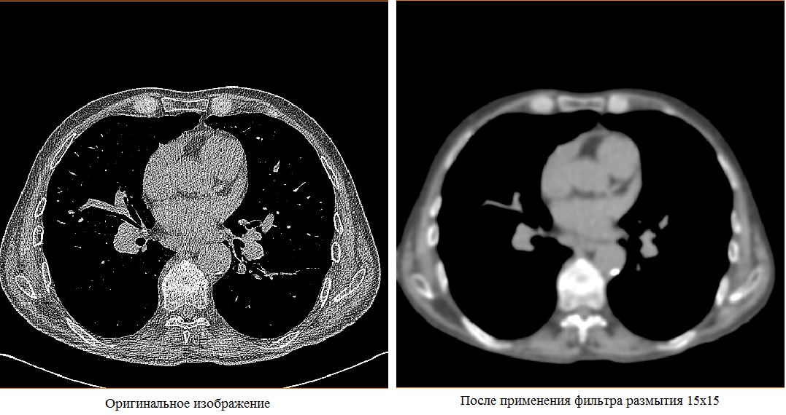15x15 показан на рисунке 13.

Рисунок 13

Стоит также сказать пару слов о недостатке фильтра размытия, да и вообще всех фильтров, использующих матрицу свертки. Дело в том, что у верхнего левого пикселя отсутствует сосед справа от него, следовательно, нам не на что умножать коэффициенты матрицы. Решений для этой проблемы существует несколько, но мы ограничимся рассмотрением лишь одного из них, поскольку этот метод не будет влиять на качество обрабатываемых изображений, а для томографических снимков, которые мы будем использовать, это очень важно. Идея состоит в создании временного изображения с размерами (width + 2 \* kernelSize / 2, height + 2 \* kernelSize / 2, где kernelSize - размер матрицы свертки, width, height - ширина и высота изображения соответственно). В центр изображения копируется входная картинка, а края заполняются крайними пикселями изображения. Размытие применяется к промежуточному буферу, а потом из него извлекается результат (см. рисунок 14).

Рисунок 14

*3.3. Фильтр средняя скользящая*

В фильтре средняя скользящая все элементы матрицы свёртки имеют одинаковое значение. Например, для данного фильтра матрица 3x3 будет выглядеть следующим образом:

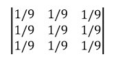

Фильтр предназначен для подавления шума в изображении, но за это мы расплачиваемся ухудшением чёткости границ объектов. Элементы изображения, которые малы по размерам по сравнению с ядром, значительно подавляются, в то время, как элементы значительно большие, чем ядро, поражаются умеренно. Степень подавления шума соответствует размеру ядра, чем больше размер этого ядра, тем лучше шумоподавление. Пример применения данного фильтра приведён на рисунке 15 (a-d).

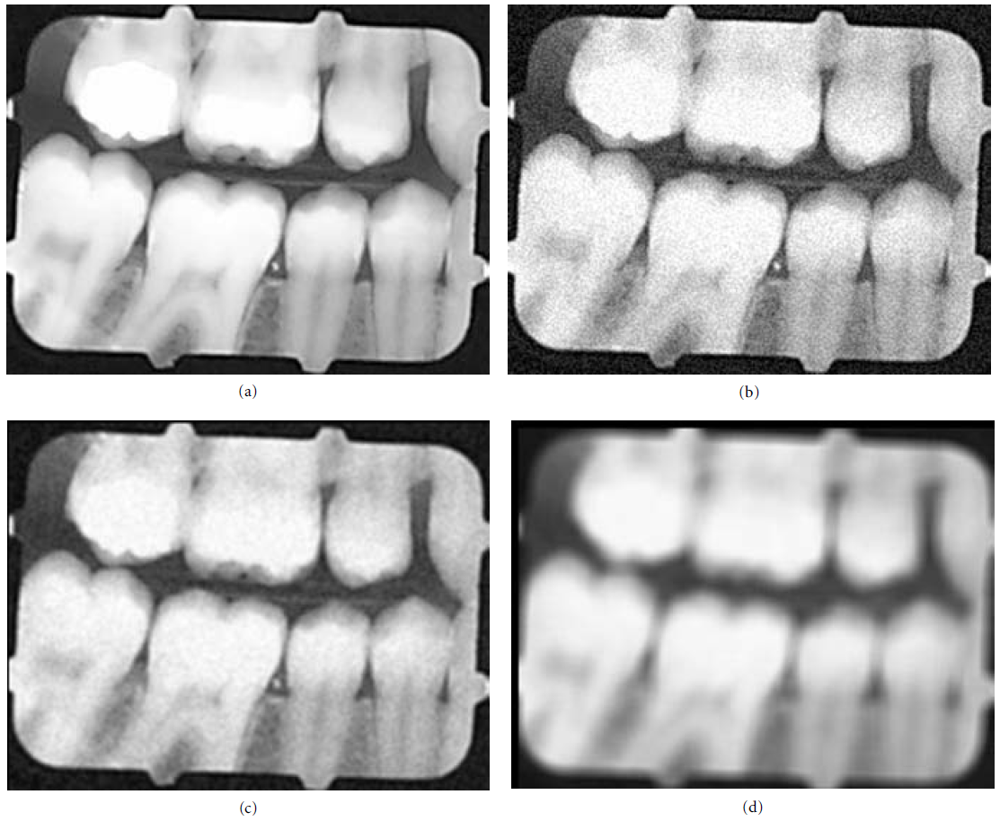Рисунок 15

На рисунке 15(a) изображен оригинал снимка. На рис. 15(b) изображён оригинал, искажённый белым гауссовским шумом. Далее это изображение пропускают через фильтр средняя скользящая, размер матрицы свёртки которого 3x3 (рис. 15 (c)). Фильтр, несомненно, убрал некоторое количество аддитивного шума, однако изображение стало смазанным. Данное изображение не будет иметь особого клинического значения. Снимок на рис. 15(b) пропустили через фильтр с матрицей 9x9 (рис. 15(d)). Фильтр удалил все эффекты аддитивного шума, однако результат оказался совершенно неприемлемым, поскольку изображение стало сильно размытым. Отсюда делается вывод, что применение данного фильтра, как и фильтра размытия, ограничивается размером матрицы свёртки.

*3.4. Медианный фильтр *

Медианный фильтр является весьма распространённым инструментом по подавлению шумов на изображении. Фильтр работает с матрицами различного размера, но в отличие от матрицы свёртки, размер матрицы влияет только на количество рассматриваемых пикселей, т.е., если предыдущие фильтры занимались тем, что перемножали матрицы друг на друга, то в данном случае, размер и сама матрица свёртки нужны лишь для того, чтобы определить размеры рассматриваемого ядра. Он не обладает такими сглаживающими свойствами, как фильтр средней скользящей. В результате использования медианного фильтра может наблюдаться утрата непрерывности границ объекта, изменение яркости изображения, однако это не оказывает сильного влияния на восприятие изображения, в то время, как значения интенсивностей пикселей могут быть сдвинуты на несколько позиций. Применение медианного фильтра позволяет подавить определённые типы шумов. Например, дробовой шум может быть полностью убран из изображения без значительного ослабления чёткости границ и характеристик самого изображения. Действие медианного фильтра изображено на рисунке 16.

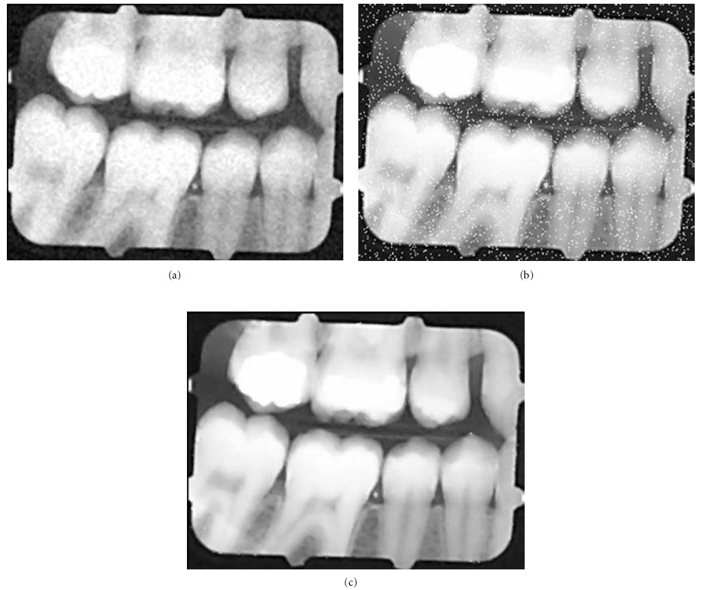Рисунок 16

На рисунке 16(a) изображен снимок из рисунка 15(b), пропущенный через медианный фильтр 3x3. Медианный фильтр не так эффективно устраняет шум, как фильтр средней скользящей, имеющий тот же размер матрицы. На рис. 16(b) изображён снимок из 16(a) с добавлением дробового шума. Далее снимок из рис. 16(b) повторно пропускают через медианный фильтр 3x3 (рис. 16(c)). Результатом такой операции, позволившей практически полностью избавится от дробового шума, становится значительное улучшение изображения. С таким изображением можно в дальнейшем работать.

Алгоритм медианного фильтра следующий: для текущего пикселя, пиксели, которые «попадают» в матрицу, сортируются, и выбирается средние значение из отсортированного массива. Это значение и является выходным для текущего пикселя. Данный алгоритм подобен поиску медианы в числовой выборке, отсюда и название, медианный фильтр. Ниже приведена 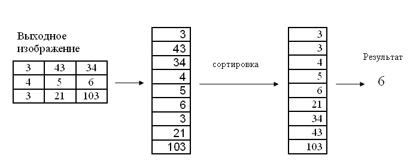иллюстрация алгоритма.

*3.5. Фильтры выделения границ*

Современные средства обработки изображений предлагают богатый выбор инструментов, которые позволяют выделять границы объектов. Таковыми являются фильтры Лапласа, Собеля, Превитта и Робертса. Мы же рассмотрим лишь первые два, поскольку они используются в программном пакете по обработке снимков компьютерной томографии Amira, который является прямым конкурентом разрабатываемого отечественного аналога.

В фильтре Лапласа может использоваться одна из трёх матриц (масок):

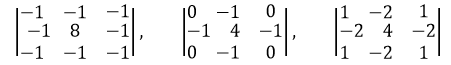

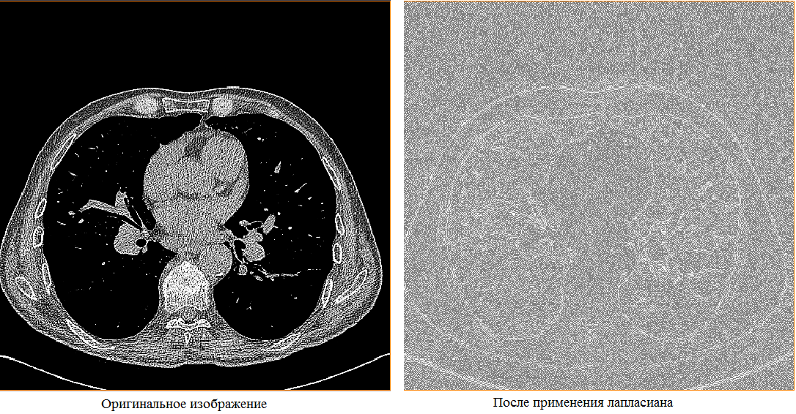К исходному изображению применяется уже знакомая операция свёртки. Результат применения фильтра Лапласа приведён на рис. 17.

Рисунок 17

Теперь рассмотрим фильтр Собеля. Он использует две маски:

Проводим рассуждения аналогичные предыдущим. Применяем операцию свёртки дважды:

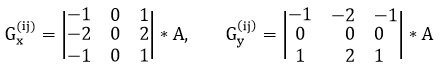

Далее вычисляем конечную интенсивность каждого пикселя:

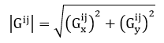

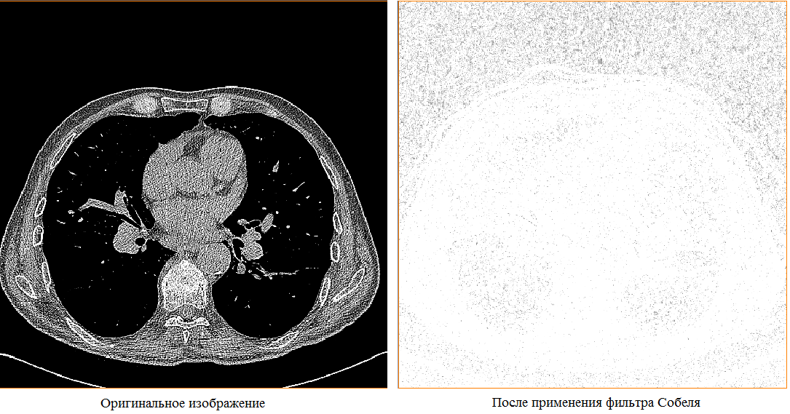Полезно также знать, что фильтр используется для приближённого вычисления градиента функции интенсивности пикселей. Применение оператора Gx позволяет определить приближённое значение первой частной производной изменения интенсивности в горизонтальном направлении, Gy – в вертикальном. Пример применения данного фильтра на КТ представлен на рисунке 18.

Рисунок 18

Оба рассмотренных фильтра очень чувствительны к шумам. Влияние шумовых эффектов может быть уменьшено сглаживанием перед выделением границ.

*3.6. Фильтры эрозии и наращивания *

Фильтры наращивание и эрозия служат для получения морфологического расширения или сужения соответственно. Проще говоря, для изображений это значит выбор пикселя с максимальной или минимальной интенсивностью из окрестности. В результате наращивания происходит увеличение ярких объектов, а эрозии – увеличение тёмных объектов (см. рисунок 19, 20).

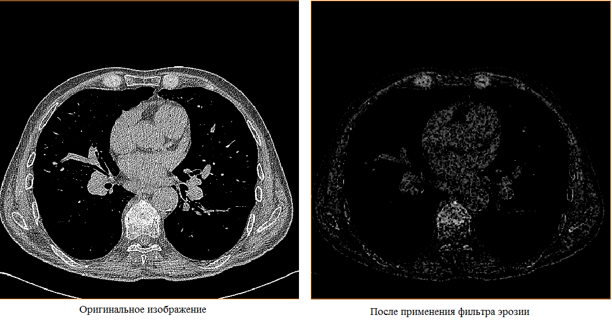
Рисунок 19

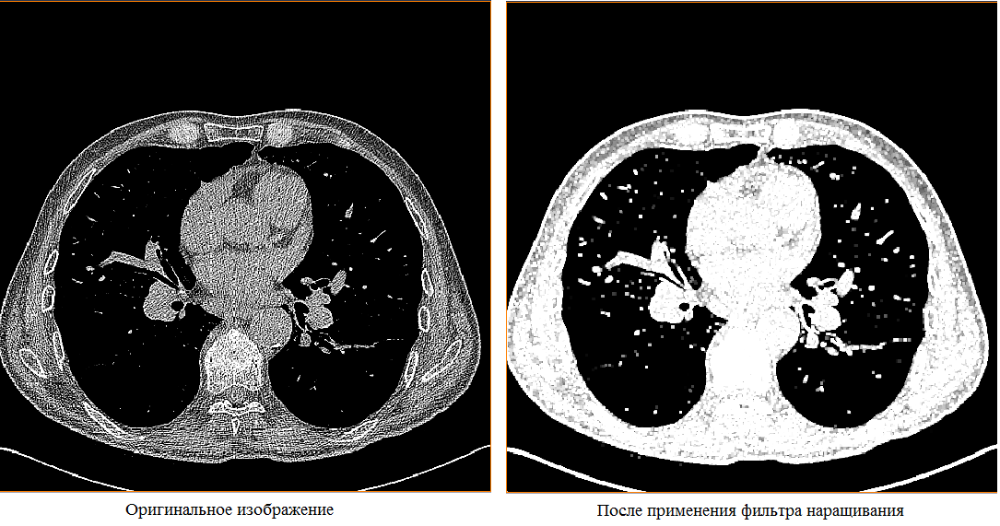

Рисунок 20

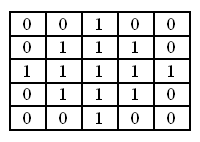Фильтр использует входное изображение и бинарную матрицу. Бинарная матрица определяет форму окрестности. Обычно окрестность имеет круглую форму.

*3.7. Комбинированное использование матричных фильтров обработки изображений*

В данном разделе будут рассмотрены и показаны преимущества комбинированных методов обработки КТ.

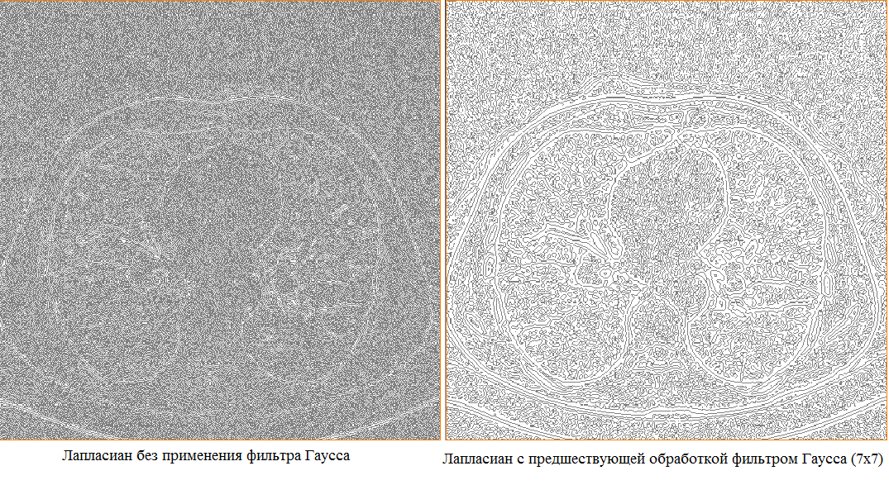Как говорилось в разделе 3.6., все фильтры выделения границ очень чувствительны к шумам. Мар и Хилдрет предложили сглаживать изображение фильтром Гаусса. Результаты выделения границ лаплассианом до и после сглаживания фильтром Гаусса показаны на рис. 21.

Рисунок 21

Как видно, изображение стало после обработки более отчётливым.

Применяем аналогичные действия c фильтром Собеля (рис. 22).

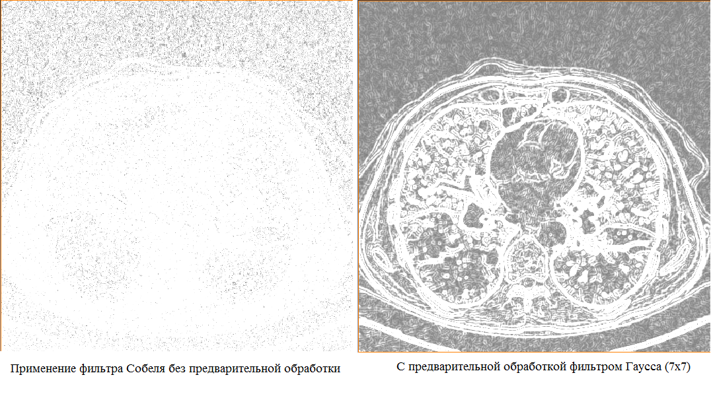

Рисунок 22

Из рисунка видно, что выделение границ, как и в случае с лаплассианом, стало видно более отчётливо.

Из приведённых выше примеров можно сделать вывод, что применением комбинаций фильтров, мы не только устраняем шумы в изображении, но и получаем требуемую информацию в должном качестве.***
***

***4. Заключение ***

В данной статье были рассмотрены математическая морфология и матричные фильтры обработки изображений, представлены алгоритмы действия перечисленных фильтров, приведены результаты их действия на снимках КТ. Выяснено и практически показано, что комбинированное применение матричных фильтров благоприятно сказывается на качестве и читабельности снимка.

**СПИСОК ИСПОЛЬЗОВАННЫХ ИСТОЧНИКОВ**

1. Isaac N.Bankman Medical imaging, processing and analysis;

2. Noriyasu Homma Theory and applications of CT imaging and analysis;

3. [*http://www.intuit.ru/studies/courses/10621/1105/lecture/17989?page=6*](http://www.intuit.ru/studies/courses/10621/1105/lecture/17989?page=6);

4. https://habrahabr.ru/post/142818/
