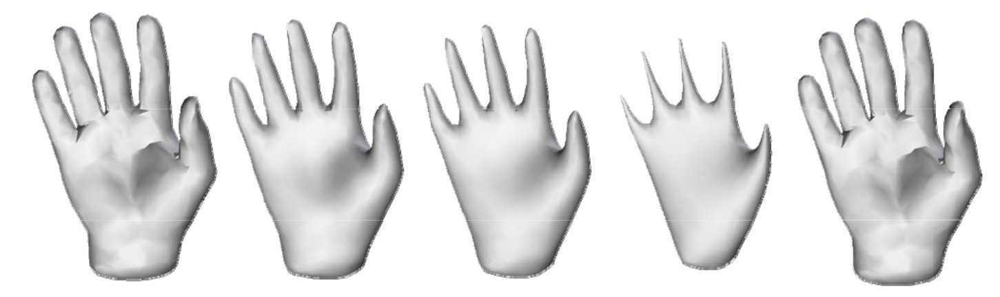

# Доклад
Алгоритмы сглаживания полигональных моделей. Проблема уменьшения объема.
========================================================================
## Введение
#### Полезный подход для получения сложных геометрических моделей в компьютерной графике - это оцифровывание. Из облака точек, полученного со сканирующих устройств, таких как лазерный сканнер или тактильный сканнер, описание поверхности может быть получено соединением точек определенным образом в полигональную сетку или набор треугольников

#### К сожалению оцифрованные точки не всегда отражают корректное расположение на реальной поверхности из-за физического шума, добавленного сканирующим устройством. Вследствие этого реконструированная поверхность зачастую выглядит неудовлетворительно. Следовательно, полигональная модель должна быть сглажена для того, чтобы устранить шум.

Основная часть
--------------
### Алгоритм Лапласа
#### Один из подходов к сглаживанию - это алгоритм Лапласа. Версии алгоритма сглаживания Лапласа известны в обработке изображений и в методе конечных элементов. Основная идея в обработке изображений - это заменить значение пикселя на среднее значение пикселей по соседству. Аналогично, расположение вершин полигональной модели в методе конечных элементов корректируется путем вычисления нового положения как среднего всех координат соседствующих вершин. Этот процесс может применяться итеративно, пока результат не будет удовлетворительным

#### Усреднение дает именно тот эффект, который нужен нам для сглаживании полигональной модели. Однако он имеет побочный эффект: при большом числе итераций модель начинает сокращаться в размерах.

### Алгоритм Гаусса

#### В методе сглаживания Гаусса новые координаты вершины вычисляются как среднее взвешенное координат самой вершины и ее соседей первого порядка: вершины, которые входят в состав одного и того же ребра или грани, которые содержат текущую вершину. Этот процесс повторяется несколько раз.

#### У алгоритма Гаусса есть ряд преимуществ по сравнению с другими алгоритмами:
#### 1. Применяется по кускам к линейным поверхностям произвольной топологии, а не только к тем, которые могут быть параметризованы функциями, определенными на прямоугольной области.
#### 2. Так как соседи первого порядка определены неявным образом в списке ребер или граней поверхности, то не требуется отводить дополнительное пространство для кодирования соседних структур.
#### 3. Количество операций - это линейная функция от количества граней, ребер и вершин.

#### Однако, так как этот метод локален, то для получения сглаживающего эффекта необходимо применять алгоритм итеративно множество раз. Побочный эффект от этого - сокращение размеров модели.

#### Замкнутый многоугольник в двух или трех измерениях обычно представлен в виде упорядоченного списка вершин V = {vi : 1 ≤ i ≤ nV}, где vi = (xi, yi)t или vi = (xi, yi, zi)t, для двухмерной и трехмерной кривой соответственно. Никакой дополнительной информации не требуется, так как кривые имеют свойственную им линейную упорядоченность. Но для разомкнутой кривой или кривой, состоящей из нескольких соединенных компонентов желательно представление в виде пар списков C = {V, E}, где V - список вершин, а E = {ek : 1 ≤ k ≤ nE} - список ребер, где каждое ребро ek = (i1k, i2k) является парой неповторяющихся индексов вершин. Поверхнось обычно представлена в виде пары списков C = {V, F}, где V - список вершин, а F = {fk : 1 ≤ k ≤ nF} - список граней, где каждая грань fk = (i1k,..., iknfk) - это последовательность неповторяющихся индексов вершин и по сути является замкнутым, не обязательно плоским многоугольником в трехмерном пространстве. В некоторых случаях количество граней nfk изменяется от грани к грани, тогда как в других случаях все грани имеют одинаковое количество вершин. Триангулированные поверхности, где все грани - это треугольники fk = (i1k, i2k, i3k) является самыми распространенными.

#### *Область* вершины vi - это набор индексов вершин i\*. Если индекс j принадлежит области i\*, то говорят, что vj - сосед vi. Ни одна вершина не должна быть своим же соседом. Допускается, что если vj - сосед vi, то vi может не быть соседом vj. Если эта ситуация не наблюдается, то структура области является *симметричной*. *Структура области* фигуры определена семейством всех областей {i\* : i = 1, 2,...,nV}. Особенно важной структурой области является структура области *первого порядка*, где для каждой пары вершин vi и vj, которые входят в состав ребра или грани, верно, что они являются соседями по отношению друг к другу. Структура области первого порядка является симметричной и, так как она неявно представлена в списке вершин, ребер или граней фигуры, то не требуется дополнительной памяти для ее хранения.

#### Алгоритм Гаусса заменяет позицию каждой вершины выпуклой комбинацией позиций самой же точки и ее соседей. Сначала, для каждой вершины vi, считается среднее вектора:

### Δvi = Σ wij(vj - vi)

#### Это взвешенное среднее векторов vj - vi, которые отходят от текущей вершины vi к соседней вершине vj. Для каждой вершины wij - положительное число, которое равно 1/|i\*|, где i\* - это область вершины vi. Когда все средние векторов посчитаны, вершины обновляются путем добавления соответствующего вектора смещения к текущей позиции каждой вершины vi: 
vi' = vi + λΔvi 
 где λ - масштабный коэффициент, vi' - новое положение вершины. λ - положительное число 0 < λ < 1, которое может быть одинаково для всех вершин или быть зависимым от каждой вершины.

### Алгоритм Таубина

#### Алгоритм состоит из двух последовательных этапов алгоритма Гаусса. После первого этапа сглаживания с положительным масштабным коэффициентом λ, следует второй этап, но уже с отрицательным масштабным коэффициентом μ, который превосходит λ по абсолютному значению (0 <  λ < -μ). Для того, чтобы получить значительный эффект сглаживания, эти шаги должны быть применены несколько раз.

#### На самом деле, этот метод производит эффект фильтра нижних частот, когда кривая, или кривизна поверхности принимается за частоту.

## Используемая литература:

### 1. Gabriel Taubin. Curve and surface smoothing without shrinkage. Technical Report RC-19536, IBM Research, April 1994.
