**Введение**

*Триангуляция* – планарный граф, все внутренние области которого являются треугольниками.

Триангуляция поверхности представляет собой аппроксимацию поверхности треугольниками.

Существует 3 основных вида триангуляции: оптимальная, жадная и триангуляция Делоне.

1. Триангуляция называется *оптимальной*, если сумма всех рёбер минимальна среди возможных триангуляций, построенных на тех же исходных точках. Для большинства реальных задач существующие алгоритмы построения триангуляции неприемлемы ввиду слишком высокой трудоёмкости.

2. Триангуляция называется *жадной*, если она построена жадным алгоритмом.

*Жадный алгоритм *

Шаг 1. Генерируется список всех возможных отрезков, соединяющих пары исходных точек, и он сортируется по длинам отрезков.

Шаг 2. Начиная с самого короткого, последовательно выполняется вставка отрезков в триангуляцию. Если отрезок не пересекается с другими ранее вставленными отрезками, то он вставляется, иначе он отбрасывается.

В связи с большой трудоёмкостью (*N*2*l**o**g**N*,   *N* − *c**h**i**s**l**o* *t**o**c**h**e**k*) на практике он почти не применяется.

**1. Триангуляция Делоне**

3. *Триангуляция Делоне*

Триангуляция удовлетворяет *условию Делоне*, если внутрь окружности, описанной вокруг любого построенного треугольника, не попадает ни одна из заданных точек триангуляции.

Триангуляция называется триангуляцией Делоне, если она является выпуклой и удовлетворяет условию Делоне.

Данная триангуляция обладает рядом практически важных свойств.

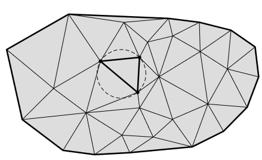

*Рис. 1.* Пример триангуляции Делоне с демонстрацией условия Делоне

Триангуляция Делоне появилась как граф, двойственный диаграмме Вороного – одной из базовых структур вычислительной геометрии.

Для заданной точки *P**i* ∈ {*P*1, …, *P**N*} *многоугольником (ячейкой) Вороного* называется геометрическое место точек на плоскости, которые находятся к *P**i* ближе, чем к любой другой заданной точке *P**j*,   *j* ≠ *i*.

Диаграммой Вороного заданного множества точек {*P*1, …, *P**N*} называется совокупность всех многоугольников Вороного этих точек.

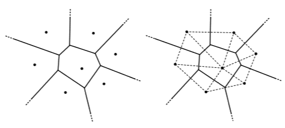

*Рис. 2.* Диаграммы Вороного: *а –* пример диаграммы; *б –* двойственная диаграмме триангуляция Делоне

Одним из главных свойств диаграммы Вороного является её двойственность триангуляции Делоне. Соединив отрезками те исходные точки, чьи многоугольники Вороного соприкасаются хотя бы углами, мы получим триангуляцию Делоне (рис. 2).

Теоремы, использующиеся в алгоритмах построения триангуляции Делоне:

**Теорема 1.** Триангуляцию Делоне можно получить из любой другой триангуляции по той же системе точек, последовательно перестраивая пары соседних треугольников *A**B**C* *i* *B**C**D*, не удовлетворяющих условию Делоне, в пары треугольников *A**B**D* *i* *A**C**D* (рис. 3). Такая операция перестроения часто называется *флипом* или *переброской* *ребра*.

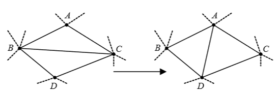

*Рис. 3*. Перестроение треугольников, не удовлетворяющих условию Делоне

**Теорема 2.** Триангуляция Делоне обладает максимальной суммой минимальных углов своих треугольников среди всех возможных триангуляций.

**Теорема 3.** Триангуляция Делоне обладает минимальной суммой радиусов окружностей, описанных около треугольников, среди всех возможных триангуляций.

**1.1 Структуры для представления триангуляции**

В триангуляции можно выделить 3 основных вида объектов: *узлы* (точки, вершины), *рёбра* (отрезки) и *треугольники*.

В работе многих существующих алгоритмов построения триангуляции Делоне и алгоритмов её анализа часто возникают следующие операции с объектами:

1.  Треугольник → узлы: получение для данного треугольника координат образующих его узлов.

2.  Треугольник → рёбра: получение для данного треугольника списка образующих его рёбер.

3.  Треугольник → треугольники: получение для данного треугольника списка соседних с ним треугольников.

4.  Ребро → узлы: получение для данного ребра координат образующих его узлов.

5.  Ребро → треугольники: получение для данного ребра списка соседних с ним треугольников.

6.  Узел →*r**i**o**b**r**a*: получение для данного узла списка смежных рёбер.

7.  Узел → треугольники: получение для данного узла списка смежных треугольников.

***Структура данных «Узлы с соседями»***

В структуре «Узлы с соседями» для каждого узла триангуляции хранятся его координаты и список номеров (или указателей) смежных (соседних, т.е. с которыми есть общие рёбра) узлов (рис.4.):

struct Point {

float X, Y, Z; //координаты узла

vector &lt;unsigned&gt; \*array; //список смежных узлов

};

*Рис. 4*. Связи узлов структуры «Узлы с соседями»

***Структура данных «Узлы и рёбра»***

В структуре «Узлы и рёбра» для каждого ребра хранятся указатели на два концевых узла.

struct Point {

float X, Y, Z; //координаты узла

};

struct Edge {

unsigned \*V\[2\]; // 2 концевых узла

};

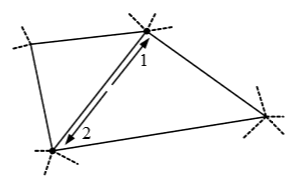

*Рис. 5*. Связи рёбер структуры «Узлы и рёбра»

***Структура данных «Двойные рёбра»***

В структуре «Двойные рёбра» основой триангуляции является список ориентированных рёбер. При этом каждое ребро входит в структуру дважды, но направленными в противоположные стороны:

struct Point {

float X, Y, Z; //координаты узла

};

struct Edge {

unsigned \*K; //концевой узел ребра

unsigned \*NE; //следующее по часовой стрелке ребро в треугольнике справа

unsigned \*Twin; //ребро-близнец

unsigned \*NTr; //указатель на треугольник справа

};

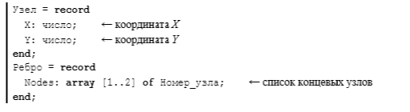

*Рис. 6.* Связи рёбер (а) и неявное задание треугольников (б) в структуре «Двойные рёбра»

***Структура данных «Узлы и треугольники»***

В структуре «Узлы и треугольники» для каждого треугольника хранятся три указателя на образующие его узлы и три указателя на смежные треугольники (рис. 7):

struct Point {

float X, Y, Z; //координаты узла

};

struct Triangle {

unsigned \*P\[3\]; //образующие узлы

vector &lt;unsigned&gt; \*array; //смежные треугольники

};

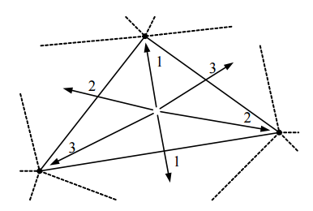

*Рис. 7.* Связи треугольников структуры «Узлы и треугольники»

Данная структура наиболее часто применяется на практике в силу своей относительной простоты и удобства программирования алгоритмов на её основе.

***Структура данных «Узлы, рёбра и треугольники»***

В структуре «Узлы, рёбра и треугольники» в явном виде задаются все объекты триангуляции: узлы, рёбра и треугольники. Для каждого ребра хранятся указатели на два концевых узла и два соседних треугольника. Для треугольников хранятся указатели на три образующих треугольник ребра (рис. 8):

struct Point {

float X, Y, Z; //координаты узла

};

struct Edge {

unsigned \*K\[2\]; //2 концевых узла

unsigned \*Tr\[2\]; //2 соседних треугольника

};

struct Triangle {

unsigned \*Edge\[3\]; //рёбра, образующие треугольник

};

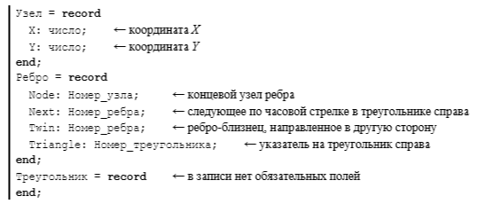

Рис. 8. Связи треугольников (слева) и рёбер (справа) структуры «Узлы, рёбра и треугольники»

Данная структура часто применяется на практике, особенно в задачах, где требуется в явном виде представлять рёбра триангуляции.

***Структура данных «Узлы, простые рёбра и треугольники» ***

Для каждого ребра хранятся указатели на два концевых узла и два соседних треугольника. Для рёбер никакой специальной информации нет. Для треугольников хранятся указатели на три узла и три ребра, образующих треугольник, а также указатели на три смежных треугольника (рис. 9):

struct Point {

float X, Y, Z; //координаты узла

};

struct Triangle {

unsigned \*P\[3\]; //образующие узлы

vector &lt;unsigned&gt; \*array; //смежные треугольники

unsigned \*Edge\[3\]; //рёбра, образующие треугольник

};

Данная структура часто применяется на практике, особенно в задачах, где требуется в явном виде представлять рёбра триангуляции.

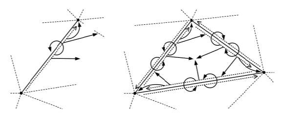

Рис. 9. Связи треугольников в структуре данных «Узлы, простые рёбра и треугольники»

В табл. 1 представлены сводные характеристики приведённых структур данных, включая затраты по памяти и степень представления различных элементов триангуляции («–» - элемент отсутствует, «+» - присутствует, «±» - присутствует, но не связей с другими элементами триангуляции).

Можно отметить, что структура «Узлы с соседями» менее удобна, чем остальные, так как не представляет в явном виде рёбра и треугольники. Среди остальных достаточно удобной в программировании является структура «Узлы и треугольники». Однако некоторые алгоритмы триангуляции требуют представления рёбер в явном виде, поэтому можно порекомендовать структуру «Узлы, рёбра и треугольники».

Таблица 1. Основные характеристики структур данных

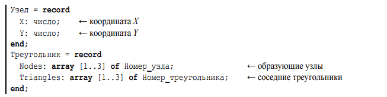

**1.2 Проверка условия Делоне**

Одной из важнейших операций, выполняемых при построении триангуляции, является проверка условия Делоне для заданных пар треугольников. На основе определения триангуляции Делоне и теоремы 2 на практике обычно используют несколько способов проверки:

1.  Проверка через уравнение описанной окружности.

2.  Проверка с заранее вычисленной описанной окружностью.

3.  Проверка суммы противолежащих углов.

4.  Модифицированная проверка суммы противолежащих углов.

Таблица 2. Среднее количество выполняемых арифметических операций в различных способах проверки условия Делоне

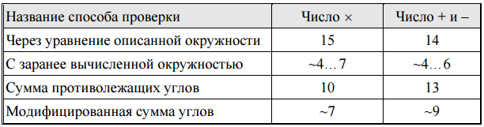

Для применения рекомендуется *модифицированная проверка суммы противолежащих углов*, требующая минимального количества арифметических операций.

**2. Алгоритмы построения триангуляции Делоне**

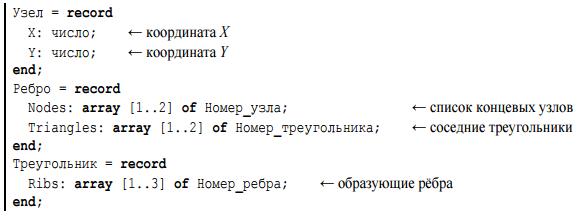

Рис. 10. Классификация алгоритмов построения триангуляции Делоне

Из всего множества представленных алгоритмов по опыту лучше всего зарекомендовал себя *алгоритм динамического кэширования*. Примерно так же хорошо работает алгоритм послойного сгущения. Оба эти алгоритма легко программируются на любых структурах данных.

На практике почти всегда возникает задача локализации некоторой точки плоскости на триангуляции – поиска треугольника, в который она попадает. Только в результате работы алгоритма динамического кэширования создаётся структура кэша, которая и позволяет эффективно выполнять указанную локализацию.

**2.1 Итеративные алгоритмы **

В основе лежит идея последовательного добавления точек в частично построенную триангуляцию Делоне.

Дано множество из N точек.

Шаг 1. На первых трёх исходных точках строим один треугольник (предполагается, что точки не лежат на одной прямой, иначе надо выбрать другие точки).

Шаг 2. В цикле по I для всех остальных точек выполняем шаги 3-5.

Шаг 3. Очередная i-я точка добавляется в уже построенную структуру триангуляции следующим образом. Вначале производится локализация точки, т.е. находится треугольник (построенный ранее), в который попадает очередная точка. Либо, если точка не попадает внутрь триангуляции, находится на границе триангуляции, ближайший к очередной точке.

Шаг 4. Если точка попала на ранее вставленный узел триангуляции, то такая точка обычно отбрасывается, иначе точка вставляется в триангуляцию в виде нового узла. При этом если точка попала на некоторое ребро, то оно разбивается на два новых, а оба смежных с ребром треугольника также делятся на два меньших. Если точка попала строго внутрь какого-нибудь треугольника, он разбивается на три новых. Если точка попала вне триангуляции, то строится один или более треугольников.

Шаг 5. Проводятся локальные проверки вновь полученных треугольников на соответствие условию Делоне и выполняются необходимые перестроения.

Сложность данного алгоритма складывается из трудоёмкости поиска треугольника, в который на очередном шаге добавляется точка, трудоёмкости построения новых треугольников, а также соответствующих перестроений структуры триангуляции в результате неудовлетворительных проверок пар соседних треугольников полученной триангуляции на выполнение условия Делоне.

**2.2 Алгоритмы построения триангуляции Делоне слиянием**

Все алгоритмы слияния предполагают разбиение исходного множества точек на несколько подмножеств, построение триангуляций на этих подмножествах, а затем объединение (слияние) нескольких триангуляций в одно целое.

**2.3 Двухпроходные алгоритмы **

Для уменьшения числа проверок условия Делоне и упрощения логики работы алгоритмов можно использовать следующий подход. Вначале за первый проход нужно построить некоторую триангуляцию, игнорируя выполнение условия Делоне. А после этого за второй проход проверить то, что получилось, и провести нужные улучшающие перестроения для приведения триангуляции к условию Делоне. Допустимость такой двухпроходной стратегии устанавливается в теореме 1.

**2.4 Алгоритмы прямого построения**

Основная идея алгоритмов прямого построения заключается в том, чтобы строить только такие треугольники, которые удовлетворяют условию Делоне в конечной триангуляции, а поэтому не должны перестраиваться.

**3. Триангуляция плоского контура**

*Триангуляция полигона –* декомпозиция многоугольника *P* на множество треугольников, внутренние области которых попарно не пересекаются и объединение которых в совокупности составляет *P* (вершины этих треугольников должны совпадать с вершинами исходного многоугольника).

**Способы нахождения триангуляции**

*Примитивный алгоритм*

Чтобы построить триангуляцию нужно найти *n* – 3 диагоналей. Для этого необходимо выяснить:

-   пересекает ли данная диагональ многоугольник;

-   принадлежит ли диагональ внутренней области многоугольника.

*Монотонный метод*

*Определение*:

Простой многоугольник называется монотонным, если граничная ломаная имеет не более двух точек пересечения с прямой, перпендикулярной данной.

Суть данного метода заключается в том, чтобы разбить многоугольник на монотонные части, а затем триангулировать каждую из них.

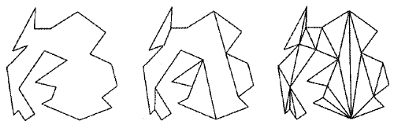

*Ушной метод*

Вершина *v**i* называется ухом, если диагональ *v**i* − 1*v**i* + 1 лежит строго во внутренней области многоугольника *P*.

В первом случае выделенная вершина является ухом, в остальных нет.

*Теорема о существовании двух ушей многоугольника:*

У любого простого *n*-вершинного многоугольника *P* всегда существует два не пересекающихся между собой уха.

Идея ушного метода заключается в нахождении уха и отрезании его от многоугольника. После этого ту же операцию повторно применяют к оставшемуся многоугольнику до тех пор, пока не останется один треугольник.

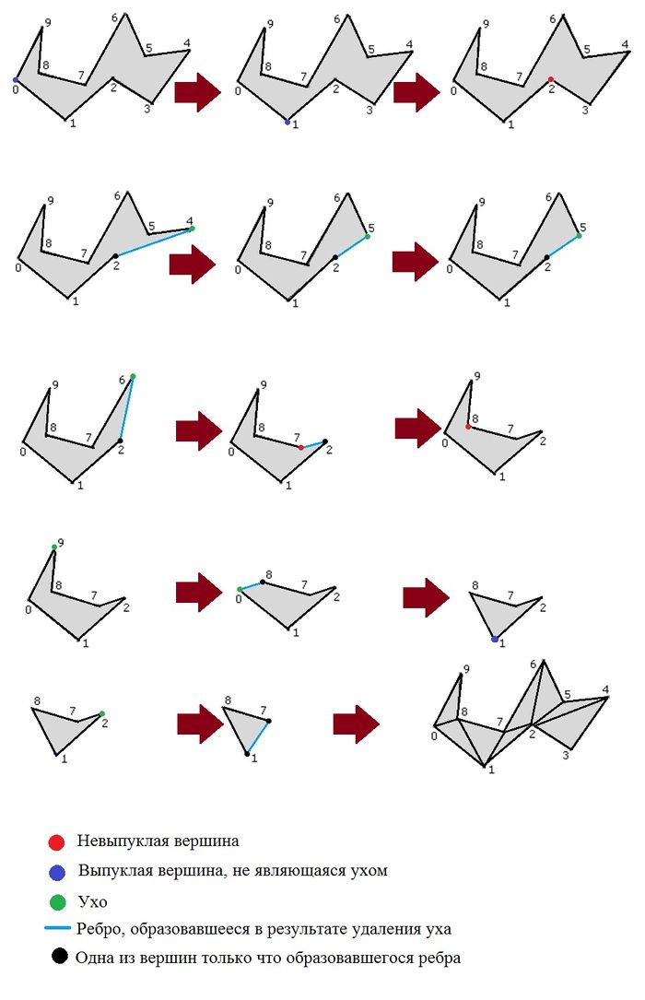
