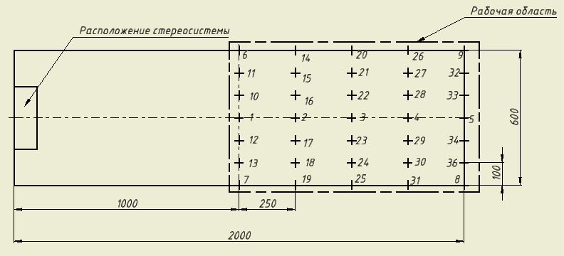

Для проведения тестирования системы используется спроектированная модель, состоящая из: миллиметровой бумаги, сферических маркеров, стоек разной высоты, линейки или другого измерительного инструмента.

Перед началом тестирования, пользователь устанавливает стереосистему, закрепленную на стойке, в центр меньшей из сторон миллиметрового листа. После этого происходит калибровка системы, после которой стереосистема не перемещается.

На лист миллиметровой бумаги наносятся следующие отметки расстояния от стереосистемы до маркера: 100 см, 125 см, 150 см, 175 см, 200 см. Данные расстояния фиксируются в таблице.

Пользователь устанавливает по 1 маркеру, расположенные на одинаковой высоте, поочередно в каждую отметку. После этого система, с заданной частотой кадра, вычисляет расстояние до маркеров, высоту и расстояние между маркерами и записывает полученные данные в ранее созданную таблицу. Размещение маркеров по следующей схеме: 
