#**1. Классификация моделей**#

В настоящее время известно довольно большое число различных методов представления трехмерных объектов. Все представления можно разделить на несколько классов:

-   Поверхностные

-   Объемные

-   Каркасные

Поверхностные модели описывают только поверхность объекта в трехмерном пространстве.

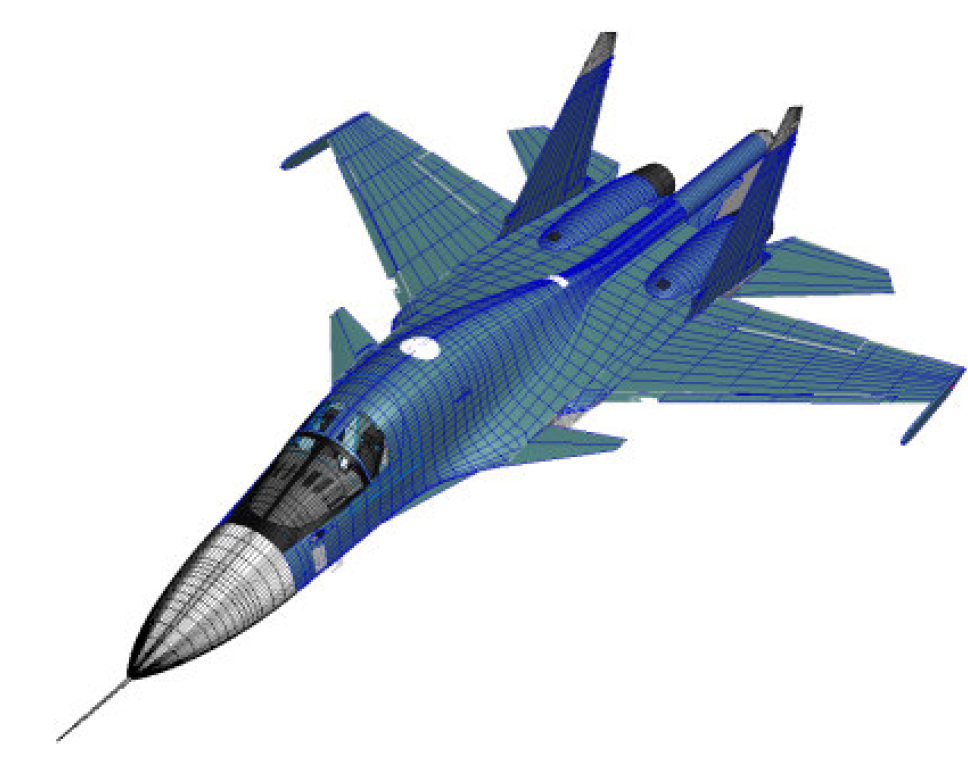

*Рисунок 1. Полигональная аппроксимация теоретических обводов самолета*

Объемные (воксельные) структуры позволяют задавать модели как часть трехмерного пространства, разбитого некоторым образом на ячейки, которые считаются заполненными, если они содержат часть объекта, и пустыми - в противном случае.

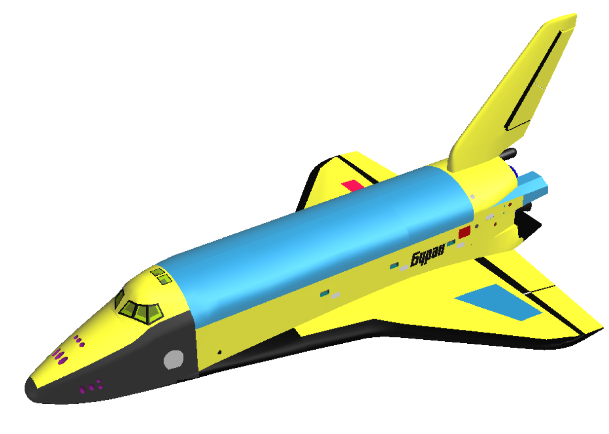

*Рисунок 2. Объемная модель теоретических обводов космического корабля буран*

При каркасном представлении, тело описывается набором ребер.

*Рисунок 3. Каркасная модель теоретических обводов космического корабля буран*

1.  ***Популярные представления***

Среди всех известных представлений наибольшее распространение получили следующие:

-   Разложение пространства на элементы (spatial subdivision)

-   Пространственная геометрия (counstructive solid geometry)

-   Граничное, поверхностное представление (boundary representation, B-rep)

**2. Моделирование путем разложения пространства на элементы**

Моделирование путем разложения описывает сплошные тела через комбинацию некоторых сплошных блоков, соединенных вместе тем или иным образом. Тип базовых объектов определяет различные методы моделирования этим способом.

***2.1. Воксельное представление***
Интересующая область пространства E3 разбивается на набор кубов (вокселей). Таким образом, можно сопоставить ей трехмерный массив cijk. Элемент массива равен 1, если куб cijk представляет собой область, занятую неким объектом, и 0 в противном случае. В некоторых случаях удобно применять некоторые промежуточные значение, задавая тем самым плотность в данной точке пространства. Таким образом (см. рисунок), создается трехмерная модель объекта.

*
*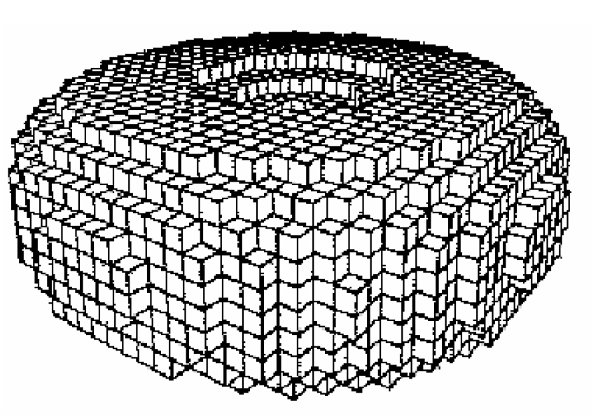*
Рисунок 4. Воксельное представление*

Некоторые характеристики такого представления:

-   Такое представление дает только приближение реального объекта. Поверхности, не параллельные осям координат, представляются приблизительно. Качество приближения зависит от относительного размера вокселей.

-   Требует больших размеров памяти для хранения, и эти требования резко возрастают при увеличении разрешения (растет как куб от разрешения).

-   С таким представлением хорошо работают в основном пространственные алгоритмы, такие как вычисление объема объекта, нахождение центра масс и т.д.

***2.2. Октарные и бинарные деревья***

Одним из недостатков воксельной модели является большой объем памяти, требуемой для хранения информации о разбиении пространства. Если хранить информацию только о блоках, относящихся к объекту, то число элементов, требуемых для представления объекта, будет пропорционально площади его поверхности, т.е. пропорционально квадрату разрешения, а не кубу, как в предыдущем случае.

*2.2.1. Октарные деревья*

Октарные деревья представляют собой рекурсивное разбиение пространства на восемь октант, которое представляется деревом (см. рисунок (а)). Обычно октарное дерево располагаются вокруг начала его локальной системы координат, так что октанты первого уровня совпадают с октантами системы координат. 

 

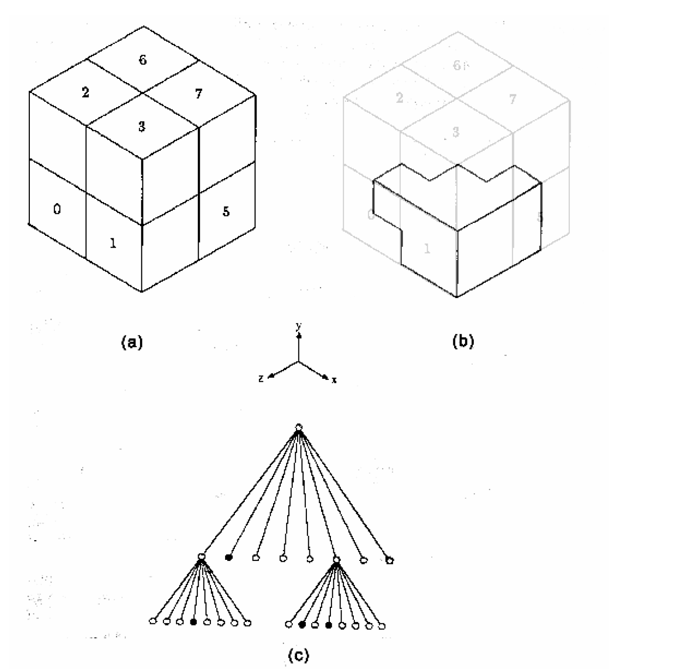*
Рисунок 5. Пример октарного дерева.*

Каждая ветвь дерева состоит из **кода** и восьми указателей на восемь потомков, пронумерованных от 0 до 7. Если код = "черный", часть пространства, представляемая этой ветвью является заполненной и все указатели нулевые, т.е это лист. Аналогично, если код = "белый", часть пространства пустая и это опять лист. Код = "серый" соответствует случаю, когда область пространства частично пуста и частично заполнена. В этом случае 8 ссылок указывают на подразбиение данной области. Например, на рисунке объект (в) представляется деревом (с) 
*Примечание*: Если рассматривается плоский случай (2D), то мы получаем квадро-деревья. В этом случае плоскость рекурсивно разбивается на занумерованные квадранты.

*2.2.2. Бинарные деревья*

Как альтернатива октарному делению пространства также возможно бинарное деление. Это представление очень похоже на предыдущее. Но здесь производится деление пространства пополам, а не на восемь частей. Деление производится последовательно в направлении осей x,y и z. 
По сравнению с октарными деревьями, бинарные требуют немного меньше памяти для хранения.

*
*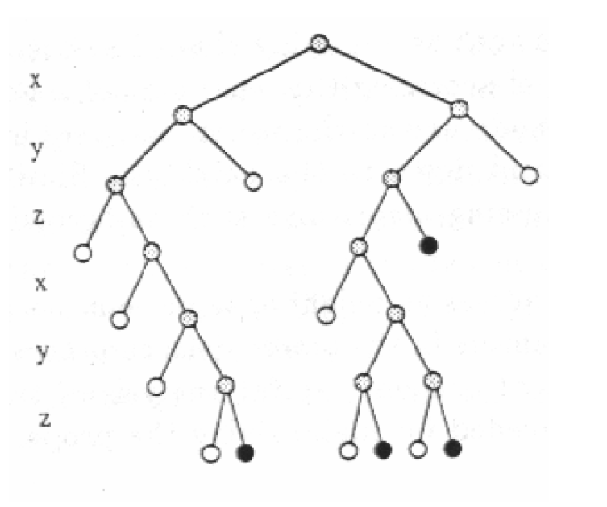*
Рисунок 6. Пример бинарного дерева*

*2.2.3 Некоторые характеристики деревьев*

-   Так же как воксельное представление, октарные и бинарные деревья дают только приблизительное представление объекта, и модель дает хорошие результаты только на ограниченном классе объектов.

-   Поддерживает эффективное выполнение булевых операций над деревьями (пересечение, объединение), геометрические операции (такие как перемещение, поворот, изменение размера)

-   Объем памяти, требуемый для хранения деревьев, пропорционален площади поверхности объекта.

**3. Пространственная геометрия (CSG)**

В пространственной геометрии объект задается набором примитивов и операций над ними. 

*
**
Рисунок 7. Дерево пространственной геометрии*

Примитивы являются "строительными блоками" объекта. Под операциями понимаются булевы операции над примитивами, а также геометрические преобразования, такие как передвижение, поворот, изменение размеров.
Можно говорить о дереве пространственной геометрии. Листьями дерева являются геометрические примитивы, каждой ветви сопоставляется операция. Вершиной дерева является искомый геометрический объект.

**4. Boundary representation, B-rep (граничное, поверхностное представление)**
В отличие от ранее описанных моделей, поверхностное представление определяет сплошное тело неявно путем описание ограничивающей его поверхности. 

*
*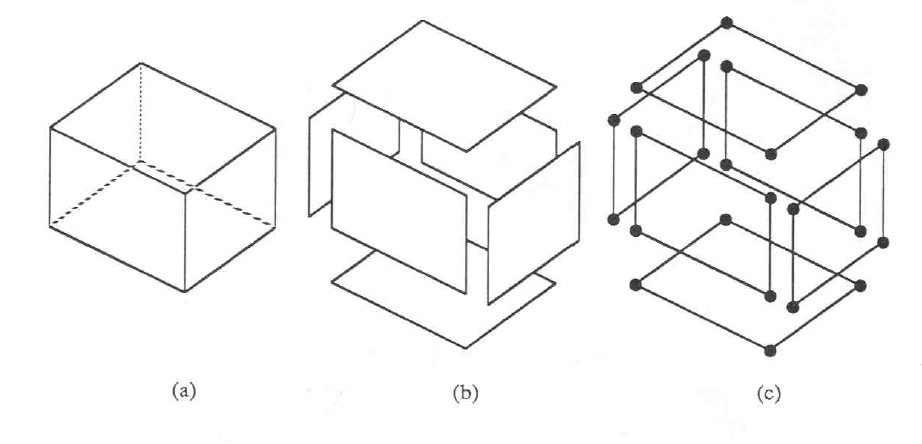*
Рисунок 8. Основные составляющие граничной модели*

Поскольку глобальная параметризация поверхности объекта произвольной формы обычно является трудновыполнимой задачей, поверхность приближается набором **граней **(face). Обычно разбиение выполняется таким образом, чтобы каждая грань имела компактное математическое представление.
Границы граней представляется **ребрами** (edge). Так - же как и грани, ребра выбираются таким образом, чтобы иметь компактное математическое описание. Часть кривой, формирующей ребро, заканчивается **вершинами** (vertex). 

***4.1. Полигональная модель***

Поверхностная модель, которая имеет только плоские грани, называется **полигональной моделью. **Рассмотрим возможные варианты задания полигональной модели. 

*4.1.1. Явное представление.*

В этом случае каждая грань есть полигон, состоящий из последовательности координат вершин. Объект состоит из набора граней. 

*
*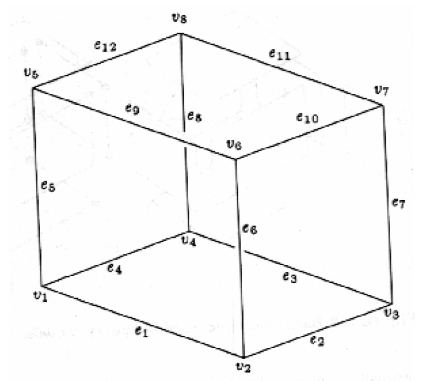*
Рисунок 9. Пример*

Недостатки такого представления в том, что, во-первых, взаимоотношения граней заданы неявно, а во-вторых, координаты каждой вершины появляются столько раз, сколько граней имеют эту вершину.

*4.1.2. Список вершин*
Повторяемость координат вершин можно обойти путем выделения координат вершин в отдельную структуру. В этом случае с гранями ассоциируются не координаты вершин, как в предыдущем случае, а индексы в массиве координат вершин. В примере (см. рисунок) будем иметь:

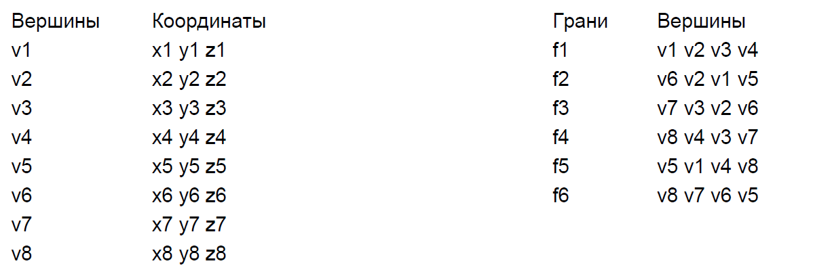
Список вершин каждой грани упорядочен по часовой стрелке, как если смотреть снаружи куба. Такое представление полезно во многих алгоритмах, таких как удаление невидимых поверхностей. Однако в таком представление остаются многие недостатки полигонального, например, задача поиска ребер, инцидентных данной вершине по-прежнему требует полного перебора. 

*4.1.3. Список ребер*

В такой модели грань представляется набором ребер и вершины грани определяются через ребра. 

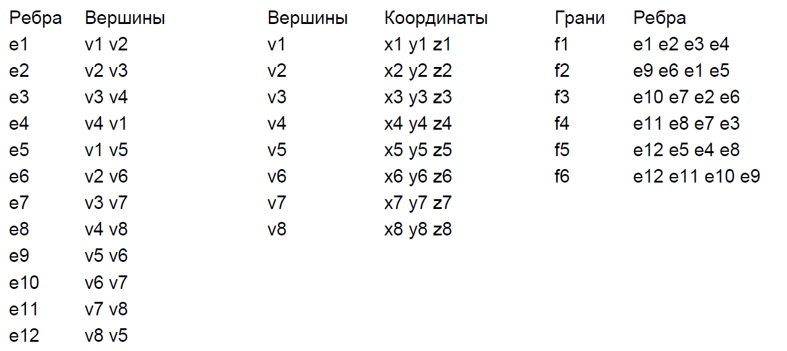
Таким образом, для каждого ребра задается направление. Например, ребро e1 направлено (имеет положительное направление) от точки v1 к точке v2. Грани также ориентированы, т.е. ребра заданы по часовой стрелке, если смотреть на куб снаружи.

*4.1.4. Winged-Edge Representation ("крылатое" представление)*

Эта модель является развитием модели, основанной на информации о ребрах.
Отличие состоит в том, что в структуру, описывающую ребра, добавляется информация о взаимном расположении граней.

*
*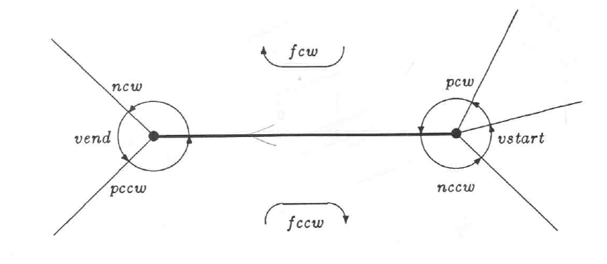*
Рисунок 10. "Крылатое" представление*

Так как каждое ребро e присутствует точно в двух гранях, ровно два других ребра e1 и e2 появляются после e в этих гранях. Более точно, поскольку направление обхода грани задано, e появляется один раз в положительной ориентации, а другой раз – в отрицательной.
"Крылатое представление" использует это путем ассоциации с каждым ребром двух "следующих" ребер. Они обозначаются как ncw и nccw ("next clockwise" и "next counterclockwise"). В данном случае ncw обозначает следующее ребро в той грани, где данное ребро появляется в положительном направлении, а nccw – следующее ребро в другой грани.
Таким образом, начиная с ребра, прямо связанного с гранью, мы может получить все другие инцидентные данной вершине ребра, следуя ссылкам ncw и nccw.
В наиболее общем случае в нашу структуру включают также ссылки на предыдущие ребра в соседних гранях. Имеем следующую структуру (см. рис):
struct edge{
pEdge ncw, pcw, pccw, nccw;
pFace fcw, fccw;
pVertex vstart, vend;
};
Здесь ncw, pcw – ссылки соответственно на следующее и предыдущее ребро в грани, в которую данное ребро входит в положительном направлении. 
Аналогично nccw, pccw – следующее и предыдущее ребро в грани, соответствующей отрицательному направлению ребра.

***4.2. NURBS***

В случае использования полигональных моделей, для достижения высокой точности требуется создание сеток с малым шагом, что ведет к росту требований к вычислительным возможностям системы.

Решить эту проблему позволяет использование поверхностей на основе кривых. В настоящее время наибольшее распространение получили поверхности на основе неоднородных рациональных фундаментальных сплайнов (Non-Uniform Rational B-spline, NURBS).

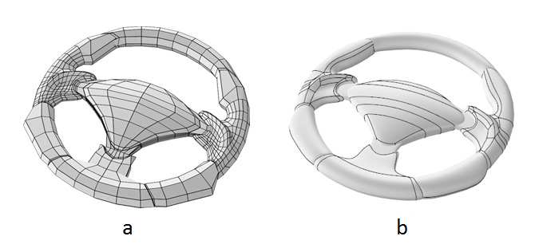

*Рисунок 11. Сравнение полигональной (а) и NURBS (и) моделей*

Формула для вычисления радиус-вектора NURBS кривой на основе B-сплайнов *N**i*, *m*(*t*), построенной по вершинам *P**i*, i = 1, 2, …, n (n≥m), обладающим весами *w**i*, имеет вид:

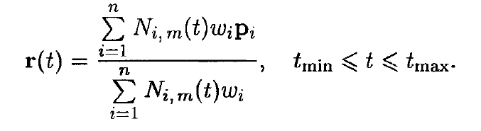

Технология NURBS обеспечивает реализацию ряда функциональных возможностей, недоступных или существенно ограниченных при использовании полигонального представления:

-   Вычисление радиуса кривизны поверхностей

-   Гладкое сопряжение поверхностей

-   Построение траекторий по поверхности

***4.3. Операции над граничными представлениями.***
Операции, наиболее характерные для граничного представления:

-   проверка правильности задания

-   вычисление габаритного объема

-   вычисление нормали в точке

-   вычисление кривизны поверхности

-   нахождение точки пересечения с лучом или кривой

-   определение положения точки относительно поверхности
